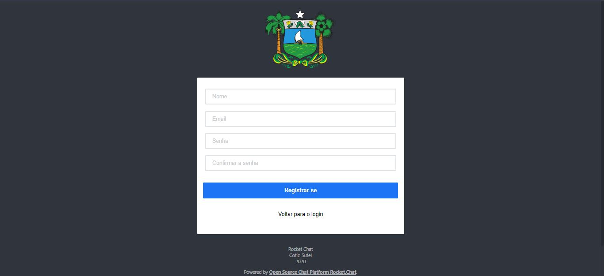
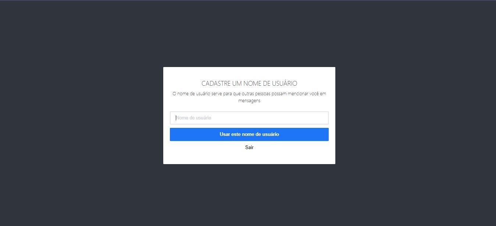
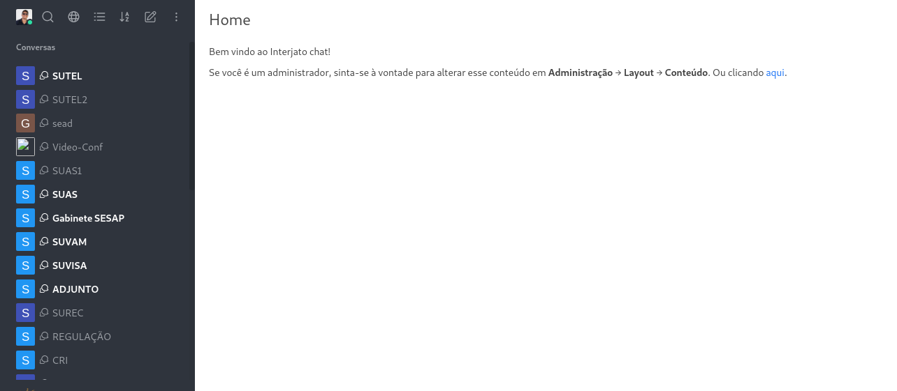
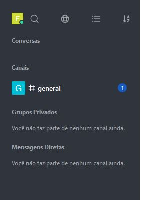
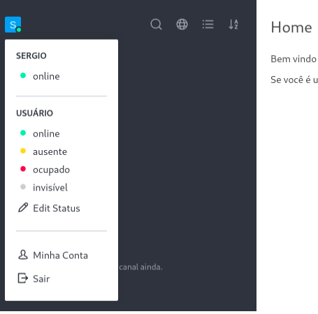
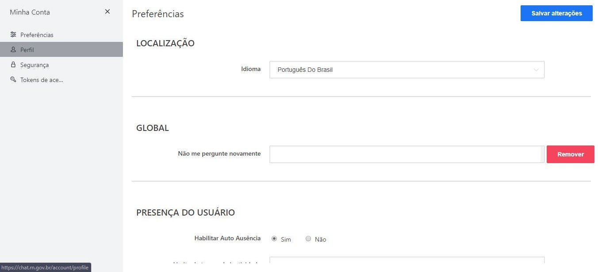
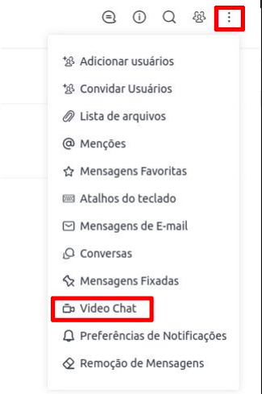
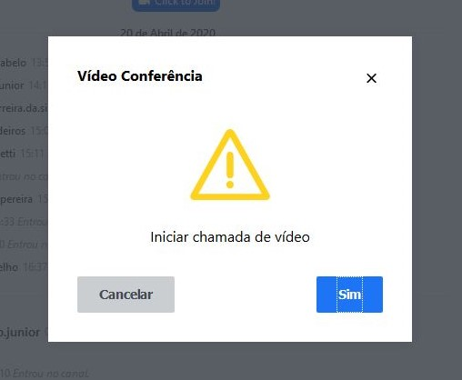

## Inicio
Vamos começar efeutando o cadastro,
Para isso voce deve [Entrar em contato](https://wa.me/558491697531) com a SEAD/COTIC para que seja enviado o link de registro.

## Tela de cadastro
Ao clicar no link enviado você  sera enviado para essa tela:

Nela, o usuário deve realizar seu cadastro inserindo as informações como nome, e-mail válido e senha que deve conter no mínimo 7 caracteres, após todos os campos preenchidos, o usuário deve confirmar o registro clicando no botão registrar-se.

## Escolhendo nome de usuario
Depois de registrado no sistema, o usuário é direcionado para uma nova tela em que deve escolher o nome do perfil dentro do ambiente. 
Essa identidade pode ser modificada em “Minha Conta”.

## Apresentação
Após o cadastro será apresentada as salas de chat.

 Uma vez dentro da sala, podemos interagir com os usuários como também iniciar videoconferência.
## Menu Lateral
No menu lateral podemos ver as informações relacionadas ao perfil de usuário, conversas, Canais públicos ou privados, discussões e mensagens diretas.

## Perfil

Clicando na foto do usuário, encontramos os status do usuário e as configurações de conta.

Clicando no campo minha conta, somos redirecionados para uma nova tela em que podemos modificar as informações. Para isso devemos selecionar no menu lateral o campo “Perfil”, como mostra na figura abaixo.

## Iniciando Videoconferência
Para acessarmos o chat de vídeo é necessário que estejamos logados na sala de chat.

Dentro dela devemos buscar o botão mais (três pontinhos) localizado no canto superior direito,
Após clicar será apresentado um menu onde podemos inicializar uma videoconferência
escolhendo o item destacado abaixo "Video Chat" , como mostra a imagem a seguir:

Depois disso, uma nova guia é
aberta com a tela de confirmação:

Basta clicar em “Sim” e entrar na sala de vídeo.