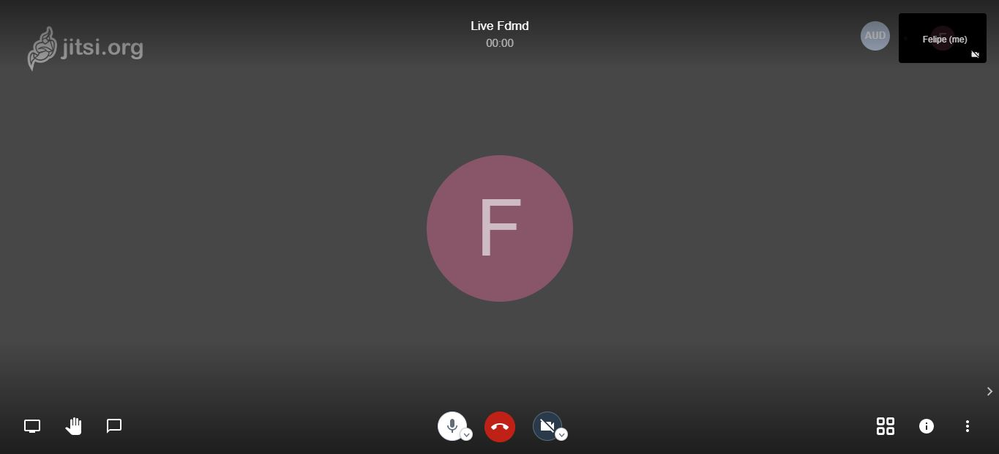
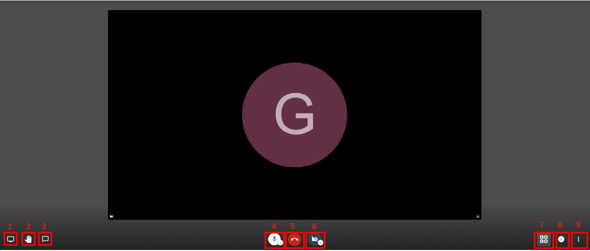
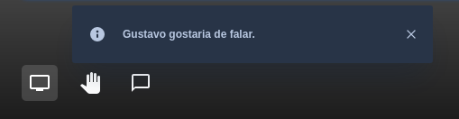
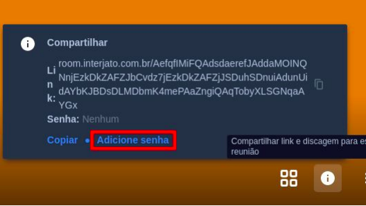

## Conhecendo a Ferramenta
Vamos começar apresentando a ferramenta ultilizada para nossas Videoconferências

Interface limpa e direta nela temos alguns botões que podem ser utilizados.
## Funções

1. Compartilhar tela: Ícone para compartilhamento de tela
2. Erguer/baixar mão: Esse Ícone solicita permissão para falar sem interromper quem está falando no momento

3. Bate papo: dentro videoconferência é possivel iniciar um chat que pode ser
utilizado para compartilhar links e outras informações, não sendo necessário
sair e depois voltar para a conferência. 

Atenção!
Todas as informações inseridas nesse novo chat seram perdidas
depois que a chamada for encerrada.
4. Mudo/ não mudo:Ícone para desativar ou ativar seu microfone.
5. Sair: Encerra o vídeo chat.
6. Iniciar ou para a câmera:Ícone para ativar
ou desativar a sua câmera.
7. Alternar a visualização em blocos: Ícone para visulizar todos os participantes
8. Compartilhar link e discagem para esta reunião: Ícone para exibir o link de compatilhamento da sala de reunião,através desse convite é possivel ter acesso direto a sala (Para evitar o livre acesso através do convite é possivel configurar senha )
9. Mais opções: Aqui são listadas diversas informações e opções, tais como
gravação,qualidade de vídeo, configurações, estatísticas do apresentador entre outros.

## Inserindo senha na sala
Ao clicar no ícone compartilhar link e discagem para esta reunião como mostra a
figura abaixo.

Clique na opção adicionar senha e no campo senha adicione a senha desejada.